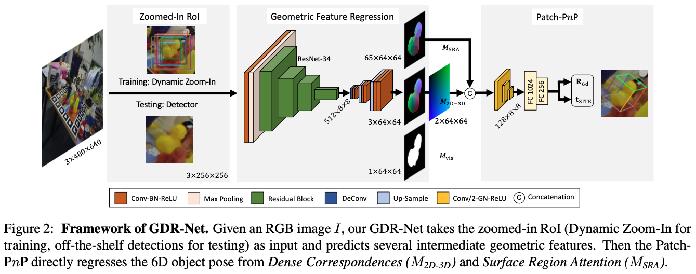

# TR-GDRN

[](https://doi.org/10.5281/zenodo.19952929)

Official implementation and reproducibility material for the manuscript:

**Robust Monocular 6D Object Pose Estimation with ConvNeXt and Hybrid Attention for Occlusion-Prone Scenes**

The manuscript is submitted to *The Visual Computer*. This repository is directly related to that submission and is intended to help readers reproduce the reported experiments on LINEMOD, LM-O, and YCB-V. If you use this code or the released checkpoints, please cite the manuscript listed in the [Citation](#citation) section.

Public repository: https://github.com/jxs0123/TR-GDRN

Zenodo archive: https://doi.org/10.5281/zenodo.19952929

## Overview

<p align="center">

</p>

TR-GDRN is a transformer-enhanced geometry-guided direct regression network for monocular RGB-based 6D object pose estimation. It follows the GDR-Net pipeline and improves the feature extraction and pose regression stages with:

- a ConvNeXt-Tiny backbone for stronger structural representation and stable small-batch training;
- a lightweight TransformerBlock2D module for long-range spatial dependency modeling;
- a Hybrid Transformer Decoder (HTD) for multi-scale memory fusion before geometry-aware pose regression.

## Requirements

The codebase is intended for Linux-based CUDA environments.

- Ubuntu 22.04
- CUDA 11.3 or 11.8
- Python >= 3.6
- PyTorch >= 1.6 and torchvision
- detectron2 installed from source

Install Python dependencies:

```bash
pip install -r requirements.txt
```

Install detectron2 from source following the official instructions:

```bash
git clone https://github.com/facebookresearch/detectron2.git
python -m pip install -e detectron2
```

Install additional project dependencies and compile the C++ extension for farthest point sampling:

```bash
sh scripts/install_deps.sh
sh core/csrc/compile.sh
```

## Dataset Preparation

Download the 6D pose datasets from the [BOP website](https://bop.felk.cvut.cz/datasets/):

- LINEMOD (LM)
- Occlusion LINEMOD (LM-O)
- YCB-Video (YCB-V)

Download [VOC 2012](https://pjreddie.com/projects/pascal-voc-dataset-mirror/) for background images used in augmentation.

The repository also expects the `image_sets` and `test_bboxes` files used by the configs. These files can be downloaded from:

- [BaiduNetDisk](https://pan.baidu.com/s/1gGoZGkuMYxhU9LBKxuSz0g), password: `qjfk`
- [Cloud.THU](https://cloud.tsinghua.edu.cn/d/b2311297acf54f26b429/), password: `fMNOASFHW0E8R72357T6mn9`

The dataset directory should follow this layout:

```text
datasets/
|-- BOP_DATASETS/
|   |-- lm/
|   |-- lmo/
|   `-- ycbv/
|-- lm_imgn/              # OpenGL rendered LM images, 1k images per object
|-- lm_renders_blender/   # Blender rendered LM images, 10k images per object
`-- VOCdevkit/
```

Recommended setup uses symbolic links:

```bash
ln -sf /path/to/BOP_DATASETS datasets/BOP_DATASETS
ln -sf /path/to/VOCdevkit datasets/VOCdevkit
```

Additional LM rendering resources:

- `lm_imgn` comes from [DeepIM](https://github.com/liyi14/mx-DeepIM) and can be downloaded from [BaiduNetDisk](https://pan.baidu.com/s/1e9SJoqb0EmyqVLEVlbNQIA), password: `vr0i`, or [Cloud.THU](https://cloud.tsinghua.edu.cn/f/22c4fba9c06f47d3aba4/), password: `A097fN8a07ufn0u70`.
- `lm_renders_blender` comes from [pvnet-rendering](https://github.com/zju3dv/pvnet-rendering). The fused data is not required.

## Training

General command:

```bash
./core/gdrn_modeling/train_gdrn.sh <config_path> <gpu_ids> [other args]
```

Train on LINEMOD:

```bash
./core/gdrn_modeling/train_gdrn.sh configs/gdrn/lm/a6_cPnP_lm13.py 0
```

Train on LM-O:

```bash
./core/gdrn_modeling/train_gdrn.sh configs/gdrn/lmo/a6_cPnP_AugAAETrunc_BG0.5_lmo_real_pbr0.1_40e.py 0
```

Train on YCB-V:

```bash
./core/gdrn_modeling/train_gdrn.sh configs/gdrn/ycbv/a6_cPnP_AugAAETrunc_BG0.5_Rsym_ycbv_real_pbr_visib20_10e.py 0
```

For multi-GPU training, pass comma-separated GPU ids, for example `0,1,2,3`. Add `--resume` to continue an interrupted experiment.

## Evaluation

General command:

```bash
./core/gdrn_modeling/test_gdrn.sh <config_path> <gpu_ids> <ckpt_path> [other args]
```

The manuscript reports ADD(-S) for LINEMOD and LM-O, and AUC of ADD-S / ADD(-S) for YCB-V.

Evaluate LINEMOD:

```bash
./core/gdrn_modeling/test_gdrn.sh configs/gdrn/lm/a6_cPnP_lm13.py 0 checkpoints/tr_gdrn_lm13.pth
```

Evaluate LM-O:

```bash
./core/gdrn_modeling/test_gdrn.sh configs/gdrn/lmo/a6_cPnP_AugAAETrunc_BG0.5_lmo_real_pbr0.1_40e.py 0 checkpoints/tr_gdrn_lmo.pth
```

Evaluate YCB-V:

```bash
./core/gdrn_modeling/test_gdrn.sh configs/gdrn/ycbv/a6_cPnP_AugAAETrunc_BG0.5_Rsym_ycbv_real_pbr_visib20_10e.py 0 checkpoints/tr_gdrn_ycbv.pth
```

Outputs are written under the `output/gdrn/` directory specified by each config.

## Checkpoints

The reproducibility release is prepared as GitHub Release `v1.0.0`:

https://github.com/jxs0123/TR-GDRN/releases/tag/v1.0.0

The release package is expected to contain:

```text
checkpoints/
|-- tr_gdrn_lm13.pth
|-- tr_gdrn_lmo.pth
`-- tr_gdrn_ycbv.pth
```

Place the downloaded `checkpoints/` directory at the repository root before running the evaluation commands above. If the release artifacts are unavailable, the same checkpoints can be regenerated with the training commands in this README.

## Key Implementation Files

- `core/gdrn_modeling/models/convnext_backbone.py`: ConvNeXt-Tiny backbone construction and feature extraction.
- `core/gdrn_modeling/models/GDRN.py`: integration of the TR-GDRN model components and the TransformerBlock2D feature enhancement.
- `core/gdrn_modeling/models/cdpn_rot_head_region.py`: geometry-aware rotation head and Hybrid Transformer Decoder for multi-scale memory fusion.

The main experiment configs are:

- `configs/gdrn/lm/a6_cPnP_lm13.py`
- `configs/gdrn/lmo/a6_cPnP_AugAAETrunc_BG0.5_lmo_real_pbr0.1_40e.py`
- `configs/gdrn/ycbv/a6_cPnP_AugAAETrunc_BG0.5_Rsym_ycbv_real_pbr_visib20_10e.py`

## DOI and Archival

The public GitHub repository is the primary code location for resubmission:

https://github.com/jxs0123/TR-GDRN

The archived Zenodo record is available at:

https://doi.org/10.5281/zenodo.19952929

## Citation

If this repository is useful for your research, please cite the related manuscript:

```bibtex
@article{ji2026trgdrn,
  title   = {Robust Monocular 6D Object Pose Estimation with ConvNeXt and Hybrid Attention for Occlusion-Prone Scenes},
  author  = {Ji, Xiaosheng and Xu, Zhen and Zhang, Chunyan and Chen, Yibo},
  journal = {The Visual Computer},
  year    = {2026},
  note    = {Manuscript submitted}
}
```

## License

This project is released under the Apache License 2.0. See [LICENSE](LICENSE) for details.

## Acknowledgements

This codebase builds on the GDR-Net-style 6D pose estimation pipeline and uses public benchmark datasets from the BOP ecosystem. We thank the authors of the related open-source projects and datasets.
